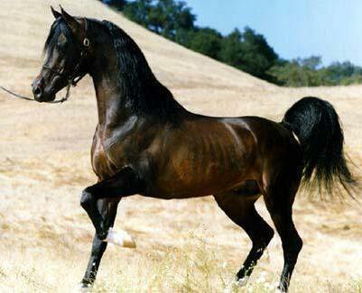
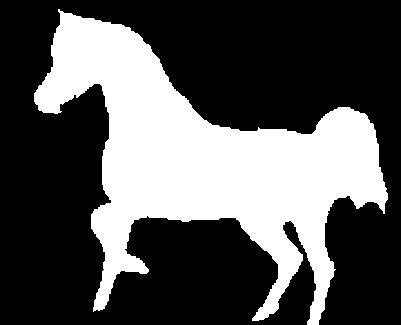
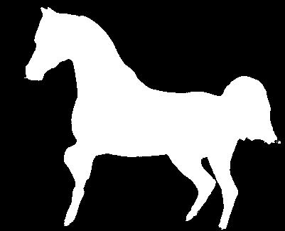

=======
# UNet in weizmann_horse

<p align="center">
     
</p>

This repository includes a plain implementation of UNet in weizmann_horse datasets:


## Updates
- 18 August 2022: upload, and this might be the final version If nothing unexpected

## Hint
There might be a promblem that resultes in a wrong UNet model being downloaded.So you need click and open the `./best_UNet.pth` to download.(I am so sorry for that)

There might be a promblem that resultes in a wrong UNet model being downloaded.So you need click and open the `./best_UNet.pth` to download.(I am so sorry for that)

There might be a promblem that resultes in a wrong UNet model being downloaded.So you need click and open the `./best_UNet.pth` to download.(I am so sorry for that)

## Version
The code has been tested on Python 3.9 and PyTorch 1.11.0. 
And you can ran it on kaggle as well.

## A Quick Demo
I have included my pretrained model just in the current path and a demo image with the corresponding mask in `./demo`. Run the following command for a quick demonstration of it.Then you can find a predicted mask in `./demo/results`.

    python demo.py
    
## Prepare Your Data
You can acquire [Weizmann Horse](https://www.kaggle.com/datasets/ztaihong/weizmann-horse-database/metadata) dataset and put them under `./train` directly.

Or replace it with your own dataset by putting the GTs and masks in the `./train/horse` and `./train/mask` respectively

````
$root
├──── train
│    ├──── horse
│    └──── mask
│    
├──── train.py
````

## Testing
In order to get the results,you need to include your GTs in  `./predict/horse`,then run the following command to do segmentation:

    python predict.py

## Training
Run the following command to train IndexNet Matting:

    python train.py
    
you don't need too much time to get a new model
>>>>>>> 9c242d2 (提交文件)
